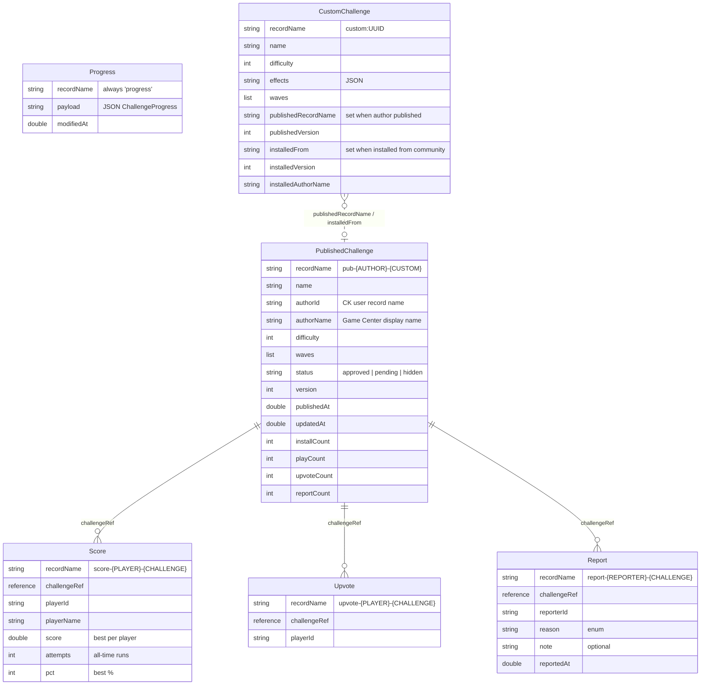

# CloudKit Schema Diagram

The container `iCloud.com.hexrain.app` splits across two databases:

- **Private DB** — per-user, free quota, invisible to other users.
  Holds backup of progress + custom challenges so a wipe / new device
  restores them.
- **Public DB** — shared corpus, queryable by everyone. Hosts the
  community-published challenges plus their leaderboards, likes, and
  reports.

## Relationships



## Database split (ASCII summary)

```
┌──────── PRIVATE DB (per-user) ────────┐   ┌──────── PUBLIC DB (shared) ────────┐
│                                       │   │                                    │
│  Progress              (1 record)     │   │  PublishedChallenge                │
│    payload: ChallengeProgress JSON    │   │    name, author, difficulty, waves │
│                                       │   │    status, version                 │
│  CustomChallenge       (N records)    │   │    installCount, playCount,        │
│    waves, effects, stars              │   │    upvoteCount, reportCount        │
│    publishedRecordName ───────────────┼──▶│    ▲    ▲    ▲                     │
│    installedFrom      ◀───────────────┼───┤    │    │    │                     │
│                                       │   │    │    │    │                     │
└───────────────────────────────────────┘   │  Score│    │  Report               │
                                            │   per-(player, challenge)          │
                                            │   best score + attempts            │
                                            │                                    │
                                            │      Upvote                        │
                                            │   per-(player, challenge)          │
                                            │   existence = liked                │
                                            └────────────────────────────────────┘
```

## Write paths

| Action                      | Touches                                          |
| ---                         | ---                                              |
| Save progress / custom edit | `Progress.upsert`, `CustomChallenge.upsert`      |
| Publish                     | `PublishedChallenge.upsert` (version++)          |
| Re-publish (silent update)  | Same record, version++; subscribers patched in place |
| Install                     | Local `CustomChallenge` (new record with `installedFrom`); `PublishedChallenge.installCount++` |
| Run end (community)         | `Score.upsert` (best score, attempts++); `PublishedChallenge.playCount++` |
| Like                        | `Upvote.upsert`; `PublishedChallenge.upvoteCount++` |
| Unlike                      | `Upvote.delete`; `PublishedChallenge.upvoteCount--` |
| Report                      | `Report.upsert`; `PublishedChallenge.reportCount++` |
| Moderator hide              | `PublishedChallenge.status = "hidden"`           |

## Read paths

| Surface                 | Query                                                                  |
| ---                     | ---                                                                    |
| Cold-launch progress pull | `Progress.fetch("progress")` + `CustomChallenge.query(TRUEPREDICATE)` |
| Community list (NEW)    | `PublishedChallenge` where `status == "approved"` sort `publishedAt`   |
| Community list (TOP)    | sort `upvoteCount`                                                     |
| Community list (ACTIVE) | sort `installCount`                                                    |
| Community list (INSTALLED) | client-side iterate local installs, fetch each `PublishedChallenge` |
| Leaderboard             | `Score` where `challengeRef == X` sort `score` desc, limit 20          |
| Has-upvoted check       | `Upvote.fetch("upvote-{PLAYER}-{CHALLENGE}")`                          |
| Live updates            | CKQuerySubscription on `recordID == X` for each installed name         |
